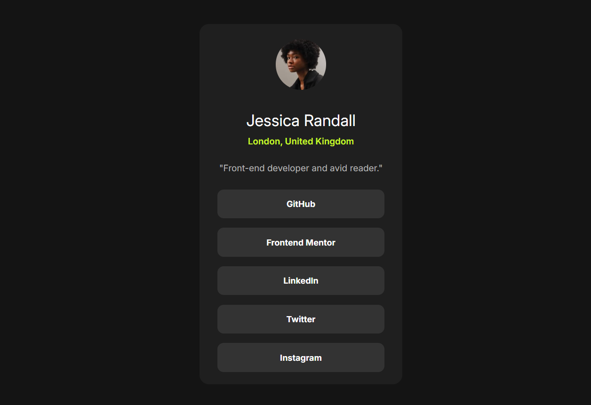

# Frontend Mentor - Social links profile solution

This is a solution to the [Social links profile challenge on Frontend Mentor](https://www.frontendmentor.io/challenges/social-links-profile-UG32l9m6dQ). Frontend Mentor challenges help you improve your coding skills by building realistic projects. 

## Table of contents

- [Overview](#overview)
  - [The challenge](#the-challenge)
  - [Screenshot](#screenshot)
  - [Links](#links)
- [My process](#my-process)
  - [Built with](#built-with)
  - [What I learned](#what-i-learned)
  - [Continued development](#continued-development)
  - [Useful resources](#useful-resources)
- [Author](#author)
- [Acknowledgments](#acknowledgments)

## Overview

### The challenge

Users should be able to:

- See hover and focus states for all interactive elements on the page

### Screenshot
- Desktop View

### Links

- Solution URL: [https://github.com/Rubaiyat-Hassan/social-links-profile-main/](https://github.com/Rubaiyat-Hassan/social-links-profile-main/)
- Live Site URL: [https://rubaiyat-hassan.github.io/social-links-profile-main/](https://rubaiyat-hassan.github.io/social-links-profile-main/)

## My process

### Built with

- Semantic HTML5 markup
- CSS custom properties
- Flexbox
- Mobile-first workflow

### What I learned

- Writing clean and semantic HTML structure
- Creating responsive designs using media queries
- Managing layout with Flexbox and ensuring visual balance

### Continued development

I would like to explore:

- Improving accessibility by using aria labels and semantic roles
- Transitioning to CSS Grid for more complex layouts
- Adding dark mode toggle using JavaScript
- Using design tokens or a utility-first CSS framework like Tailwind CSS

### Useful resources

- [MDN Web Docs](https://developer.mozilla.org/) - For general HTML/CSS reference.
- [Frontend Mentor community](https://www.frontendmentor.io/) - Great help on common design patterns.

## Author

- Website - [Rubaiyat Hassan Ifrad](https://github.com/Rubaiyat-Hassan)
- Frontend Mentor - [Rubaiyat-Hassan](https://www.frontendmentor.io/profile/Rubaiyat-Hassan)

## Acknowledgments

Big thanks to:
- [Frontend Mentor](https://www.frontendmentor.io/) for providing the challenge
- [MDN Web Docs](https://developer.mozilla.org/) for references during development
- The open-source community for helpful tips and resources
